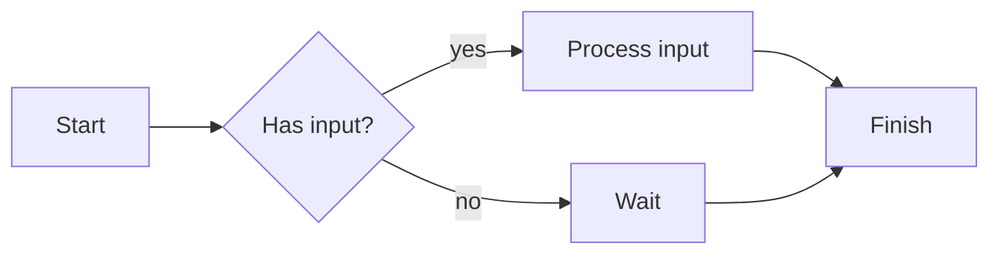
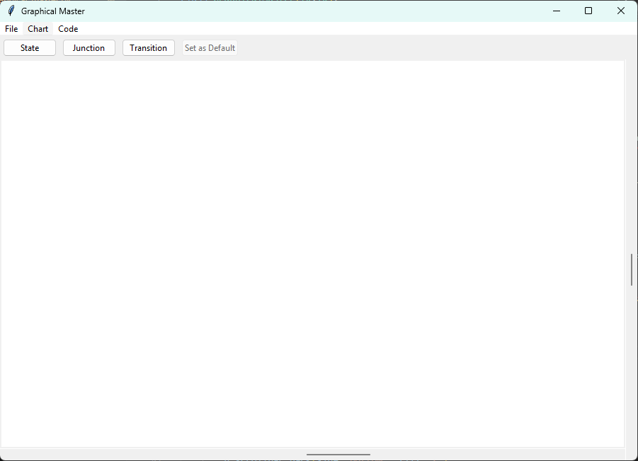
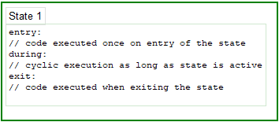
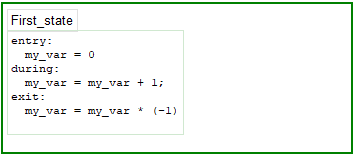
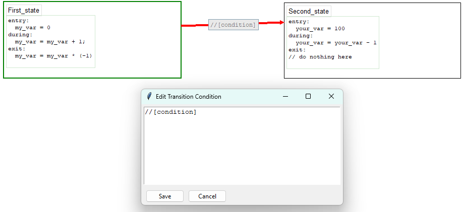
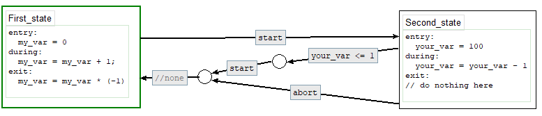
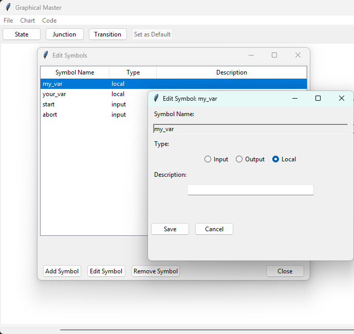
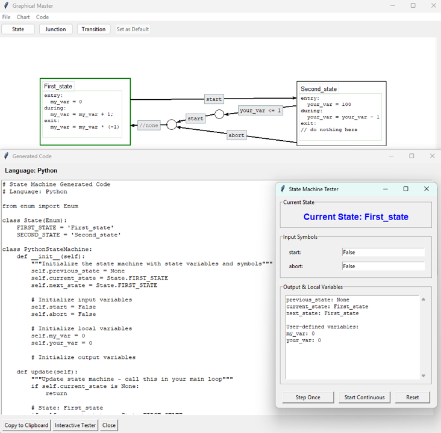

## interactive, graphical Statemachine input 
this project is my unprofessional, half-assed attempt at re-reacting the stateflow input method as a *python* construct.
This is expected to be pursued loosely and seldomly and heavily assisted by AI

something along those lines:

## Version 1.0.0:
There are (as of now) two modules to the package: graphical input and code generators. Right now, the code gen is tailored for the systematic of the graphical input and the data structure behind it. 

Starting the graphical_master should bring up this window:

Selecting _State_ lets you place a block representing a state on the canvas:

Fields outlines in light gray are editable, i.e. a name for the state can be given and the code is customizeable too:

The state can be dragged around on the canvas by grabbing it outside the text areas. The lower right corner is the place to grab for resizing the block. The block needs to be selected in order to manipulate it, the selection is shown as a red outline.
pressing the delete button removes the selected item.

To create a condition for the transition between two states select _Transition_ and draw the line from start to goal. The line is created from border to border, starting or ending the transitional line somewhere else fails silently.

The transition bears a text box for entering the logical condition for the transition.

more complex logic can be implemented using the junction

And that covers about it. Statemachines can be designed using these items.

In order to have the statemachine communicate as intended, the symbols/ variables have to be declared. Under _Chart_ select _edit symbols_

This is pretty self explanatory. Right now the computer guesses the data types!

After designing the chart in the way shown, code can be generated and tested.

Select _Code_ --> Update/Show Code
The Buttons of the tester do as expected.
