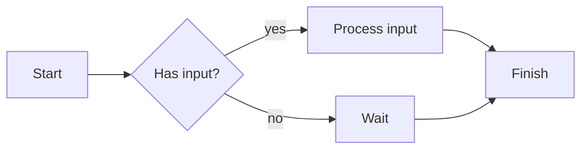

## interactive, graphical Statemachine input 
this project is my unprofessional, half-assed attempt at re-reacting the stateflow input method as a *python* construct.
This is expected to be pursued loosely and seldomly 

something along those lines:

